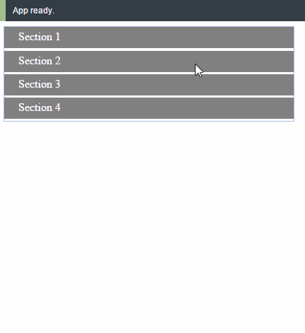

# React Accordion
[](https://gitter.im/cht8687/help)

<big><h1 align="center">React implementation of Accordion.</h1></big>

<p align="center">
<a href="https://circleci.com/gh/cht8687/react-accordion">
    
  </a>

  <a href="https://www.npmjs.com/package/react-accordion-components">
    
  </a>

 <a href="https://coveralls.io/github/cht8687/react-accordion?branch=master">
    
 </a>

  <a href="https://travis-ci.org/cht8687/react-accordion">
    
  </a>

  <a href="https://npmjs.org/package/react-accordion">
    
  </a>

  <a href="https://david-dm.org/cht8687/react-accordion.svg">
    
  </a>

  <a href="https://github.com/cht8687/react-accordion/blob/master/LICENSE">
    
  </a>
</p>

<p align="center"><big>

</big></p>




## Installation

### npm

```
$ npm install --save react-accordion-components
```

## Demo

[http://cht8687.github.io/react-accordion/example/](http://cht8687.github.io/react-accordion/example/)

## API

```js
<ReactAccordion 
        data={data} 
        options={options}
        headerAttName="headerName"
        itemsAttName="items" 
      />
```

The component accepts three props.

#### `data`: PropTypes.array.isRequired

```js
const DATA = [
  {
    headerName : "Section 1",
    isOpened: true,
    items : [{
      paragraph : "Mauris mauris ante, blandit et, ultrices a, suscipit eget, quam. Integer ut neque. Vivamus nisi metus, molestie vel, gravida in, condimentum sit amet, nunc. Nam a nibh. Donec suscipit eros. Nam mi. Proin viverra leo ut odio. Curabitur malesuada. Vestibulum a velit eu ante scelerisque vulputate."
    }],
    height: 100
  }, {
    headerName : "Section 2",
    isOpened: false,
    items : [{
      paragraph : "Mauris mauris ante, blandit et, ultrices a, suscipit eget, quam. Integer ut neque. Vivamus nisi metus, molestie vel, gravida in, condimentum sit amet, nunc. Nam a nibh. Donec suscipit eros. Nam mi. Proin viverra leo ut odio. Curabitur malesuada. Vestibulum a velit eu ante scelerisque vulputate."
    }],
    height: 100
  },{
    headerName : "Section 3",
    isOpened: false,
    items : [{
      paragraph : "Mauris mauris ante, blandit et, ultrices a, suscipit eget, quam. Integer ut neque. Vivamus nisi metus, molestie vel, gravida in, condimentum sit amet, nunc. Nam a nibh. Donec suscipit eros. Nam mi. Proin viverra leo ut odio. Curabitur malesuada. Vestibulum a velit eu ante scelerisque vulputate."
    }],
    height: 100
  },{
    headerName : "Section 4",
    isOpened: false,
    items : [{
      paragraph : "Mauris mauris ante, blandit et, ultrices a, suscipit eget, quam. Integer ut neque. Vivamus nisi metus, molestie vel, gravida in, condimentum sit amet, nunc. Nam a nibh. Donec suscipit eros. Nam mi. Proin viverra leo ut odio. Curabitur malesuada. Vestibulum a velit eu ante scelerisque vulputate."
    }],
    height: 100
  },
];
```

`height` controls how much height that certain cell will be look like.
This helps you when you have different contents length.

#### `options`: PropTypes.object.isRequired

`autoClapse` indicate if close other section when new section being clicked.

```js
const OPTIONS = {
  autoClapse: true,
}

```

#### `headerAttName`: PropTypes.string.isRequired

variable name of section header in your `data` object.
In above example, it's `headerName`.

#### `itemsAttName`: PropTypes.string.isRequired

variable name which hold items data in your `data` object.
In above example, it's `items`.

## Styling

The CSS is flexible, commented and made to be easily customized.

There is an CSS file in the root level you can include it in your project.
[CSS code](https://github.com/cht8687/react-accordion/tree/master/react-accordion.css).

## Development

```
$ git clone git@github.com:cht8687/react-accordion.git
$ cd react-accordion
$ npm install
$ webpack-dev-server
```

Then

```
open http://localhost:8080/webpack-dev-server/
```

## License

MIT